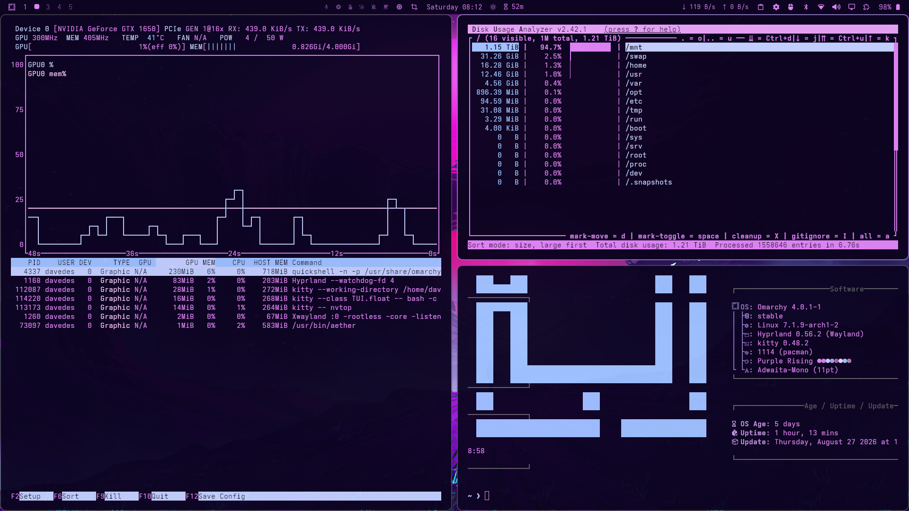

# Purple Rising

A dark, cosmic purple theme for Omarchy — deep violet backgrounds with soft lavender and pink accents.



## Install

```bash
omarchy theme install purple-rising
```

## Colors

| Role    | Color | Hex       |
| ------- | ----- | --------- |
| Background   |       | `#0D0422` |
| Dark Background |  | `#0a031a` |
| Darker Background | | `#070211` |
| Lighter Background | | `#251d38` |
| Foreground |      | `#DD83F3` |
| Accent   |       | `#8673b5` |
| Selection |      | `#251d38` |
| Muted    |       | `#636268` |
| Red      |       | `#b482b2` |
| Yellow   |       | `#ffceff` |
| Orange   |       | `#bf95be` |
| Green    |       | `#9ec2ff` |
| Cyan     |       | `#c4d0ff` |
| Blue     |       | `#8673b5` |
| Magenta  |       | `#c596e3` |
| Brown    |       | `#735972` |

## Files

- `colors.toml` — theme palette (generated by Aether for Omarchy v4)
- `icons.theme` — icon theme (Yaru-purple)
- `backgrounds/purple-rising.png` — theme preview screenshot
- `backgrounds/purple-rising.jpg` — wallpaper