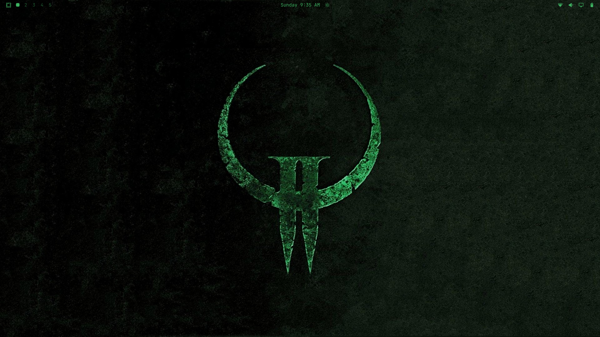

# omarchy-q2dm1-theme

A gritty, industrial green Omarchy theme inspired by the legendary **Quake II** multiplayer deathmatch map *q2dm1: The Edge*. Built using the Aether design suite and color-matched for a nostalgic, high-visibility terminal environment.



## Features
* **Colors:** A specialized `colors.toml` palette inspired by the toxic slimes, rusty steel structures, and computer terminals of Quake II.
* **Icons:** Green system and file manager icon sets.
* **Wallpaper:** The Quake II logo.

## File Structure
```text
omarchy-q2dm1-theme/
├── backgrounds/
│   └── q2dm1.jpg
├── colors.toml
└── icons.theme
```

## Installation

### Via the Terminal
You can quickly install and download this theme dynamically by targeting this repository with the Omarchy theme installer:

```bash
omarchy theme install https://github.com/TheLinuxITGuy/omarchy-q2dm1-theme
```
### Via the Graphical Interface
1. Copy the full URL of this GitHub repository.
2. Open the Omarchy system menu using `Super + Space`.
3. Navigate to **Install > Style > Theme**.
4. Paste the repository URL to pull and apply the configuration.

## Activation
Once downloaded, trigger the theme selector using the system hotkey:

`Super + Ctrl + Shift + Space`

Select **omarchy-q2dm1-theme** from the interactive overlay to apply the terminal colors, shell themes, and icon packages universally.
